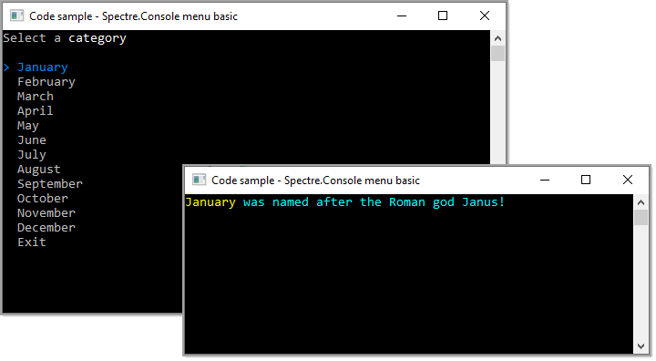

# About

Simple example for showing a menu in a console project for VB.NET using [Spectre.Console ](https://www.nuget.org/packages/Spectre.Console/0.44.0?_src=template)NuGet package and [ConsoleHelperLibrary](https://www.nuget.org/packages/ConsoleHelperLibrary/1.0.2?_src=template) NuGet package to center a console window (has more options, see source repository).

